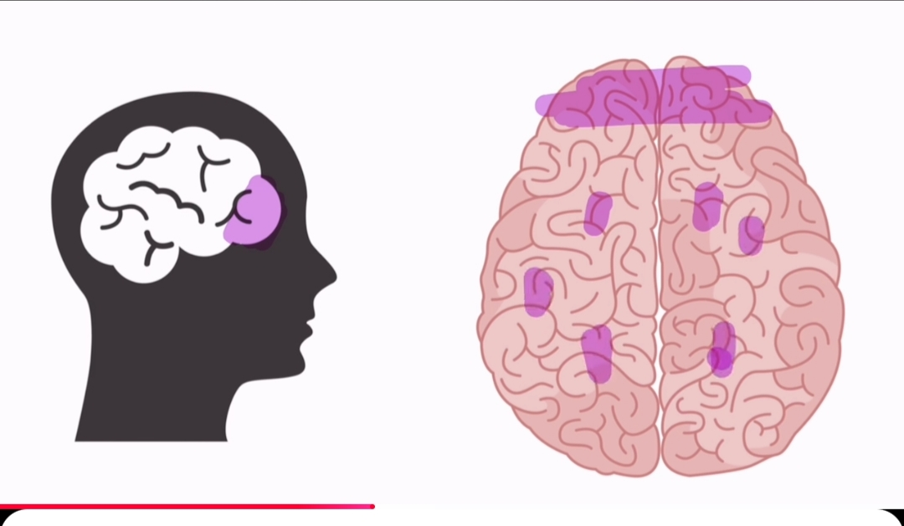

# Tense

S,SS,sh,ch,o,x থাকলে es যোগ হয়।
না থাকলে e যোগ হয়

## কথা  সুন্দর হবে

(১) জিব্বার আগাই বাজিয়ে কথা বলতে হবে। অথবা মুথা গলাই

(২) পাশা পাশি হাসি থাকতে হবে।

African accent এ কথা বলতে হবে।

sub+am/is/ar+v1+adv+adj+nowne

 ## youtube থেকে acccent শিখতে হবে

 Shadowing English Speaking Practice [ Shadowing কথাটি লিখতে হবে]
 

## (1) Sentence

Structure অনুযায়ী: ৪ প্রকার → Simple, Compound, Complex, Compound-Complex

Function অনুযায়ী: ৪ প্রকার → Declarative, Interrogative, Imperative, Exclamatory

## (2) Parts of Soeech

মনে রাখার কৌশল:- N-P-V-A-A-P-C-I

Tense শেখা = Verb বোঝা দরকার

Article শেখা = Noun বোঝা দরকার

Modifier শেখা = Adjective, Adverb বোঝা দরকার

Preposition শেখা = Noun, Pronoun এর সাথে কিভাবে ব্যবহৃত হয় সেটা বোঝা দরকার

## (3) Tanse

## What এর ব্যাবহার

what এর পর কখন do সাহায্য কারি হিসাবে বসে

what+do+you+ verb [ যখন verb থাকে]

What+are/is/are+your father name [ Father এখানে pronoun মাননে verb ছাড়া ]

## which এর ব্যাবহার,  which এর পরে (ব্যাক্তি বাচচক/বস্তু বাচক শব্দ বস্তে পারে)

in which County= কোন দেশের মধ্যে

for which conty = কোন দেশের জন্য

with which county= কোন দেশের সাথে

About which county= কোন দেশ সমন্দে

by which county= কোন দেশ দ্বারা

without which county= কোন দেশ ছাড়া

## Adverb of Manner (কিভাবে)

slowly – ধীরে
quickly – দ্রুত
well – ভালোভাবে
badly – খারাপভাবে
carefully – সতর্কভাবে
easily – সহজে
clearly – স্পষ্টভাবে
loudly – জোরে
quietly – চুপচাপ

🔹 Adverb of Time (কখন)

now – এখন
then – তখন
today – আজ
yesterday – গতকাল
tomorrow – আগামীকাল
early – আগে
late – দেরিতে
soon – শিগগিরই

🔹 Adverb of Place (কোথায়)

here – এখানে
there – সেখানে
inside – ভেতরে
outside – বাইরে
up – উপরে
down – নিচে
near – কাছে
far – দূরে

🔹 Adverb of Frequency (কতবার)

always – সবসময়
usually – সাধারণত
often – প্রায়ই
sometimes – কখনো কখনো
rarely – কদাচিৎ
never – কখনোই না
daily – প্রতিদিন
weekly – সাপ্তাহিক

🔹 Adverb of Degree (কতটা)

very – খুব
too – অতিরিক্ত
quite – বেশ
almost – প্রায়
enough – যথেষ্ট
so – এত
extremely – অত্যন্ত

🔹 Interrogative Adverb (প্রশ্নবাচক)

how – কিভাবে
when – কখন
where – কোথায়
why – কেন

## Whose VS whom অর্থ কার

whose Father= কার বাবা [ whose এর পরে Noune হবে]

whose father plays the game here?

whose this book?

whom হছে objectiv from [ এক জন ব্যাক্তি বোঝাতে] এর অর্থ কাকে/কাদের কে

whom= কাকে/ কাদের কে

with whome = কাদের সাথে [ With home are you spacking? ]

## প্রতিদিনের কথোপকথনে এইরকম কত গুলো কমন বাক্যাংশ (Common Phrases) ব্যবহার হয়?

👉 বিদেশিরা, বিশেষ করে যারা Native English Speaker (যেমন: আমেরিকান, ব্রিটিশ), তারা প্রতিদিন প্রায় ২০০–৫০০টা common phrase বা expression ব্যবহার করে, যা কথা বলার সময় স্বাভাবিকভাবে মুখ থেকে বেরিয়ে আসে।

 even
some time
some think
Rolac 10 mg

(1) Linking phrases	30–50	
(2) Quantifiers	20–30	
(3) Comparative phrases	20–40	
(4) Idioms & expressions	100+
(5) Casual greetings & responses	50–70	

## conjantion

as well as - পাশা পাশি

i am a student as well as  teacher

as for as - যতদূর

as for as i know,  he is a teacher.

that's why - তাই/এই কারনে

exam:- i was sick that's why i don't go to collage.

a lot of - অনেক

ex:- there is lot of people living vr.

kind of-- কিছু

i'm kind of sick.

## 🔹 সাধারণত ব্যবহৃত contraction গুলো:

1. wanna = want to

I wanna eat. 👉 I want to eat.

Do you wanna go? 👉 Do you want to go?

2. gonna = going to

I’m gonna call him. 👉 I’m going to call him.

3. gotta = got to / have to

I gotta go now. 👉 I have to go now.

4. lemme = let me

Lemme help you. 👉 Let me help you.

5. gimme = give me

Gimme some water. 👉 Give me some water.

6. kinda = kind of

It’s kinda funny. 👉 It is kind of funny.

7. outta = out of

I’m outta money. 👉 I am out of money.

8. gonna wanna (একসাথে শোনা যায় কখনো)

You’re gonna wanna see this. 👉 You are going to want to see this.

## এস্টা ইংরেজি

I need to get ready for work

Bruva

whenever i get a time.

I think here present every single person is a motivational speaker

i gonna be 24 age.

## মাইন্ড টেডিং

(১) working memory [ মাথার প্রথম অংশ]

(২) long term memory [ ফুটা ফুটা মাতার মধ্যের অংশ গুলো]

[ working memory থেকে long term memory নিতে চাইলে প্রতেক দিন চর্চা করতে হবে)

<!--[profile](./g.jpg)-->

 
